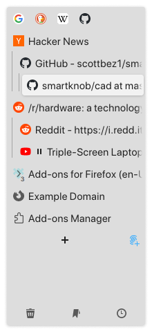
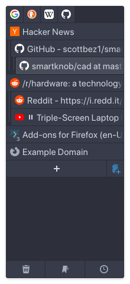
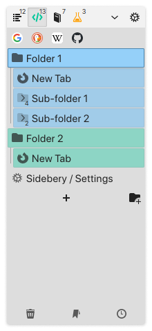
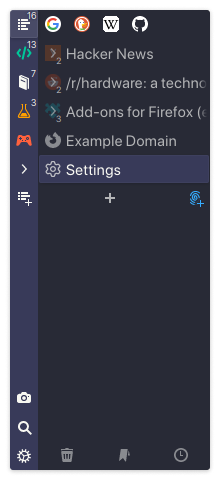
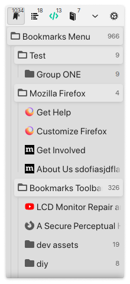

<div align="center">


<br>
<br>

Firefox extension for managing tabs and bookmarks in sidebar.

</div>

<br>

<div align="center">



</div>

<br>

<div align="center">


</div>

## Install

**Stable** (v5.2.0):
[Release page](https://github.com/mbnuqw/sidebery/releases/tag/v5.2.0) |
[Addon page](https://addons.mozilla.org/firefox/addon/sidebery/) |
[Install](https://addons.mozilla.org/firefox/downloads/file/4246774/sidebery-5.2.0.xpi) (reviewed by Mozilla)  
**Nightly** (v5.2.0.3):
[Release page](https://github.com/mbnuqw/sidebery/releases/tag/v5.2.0) |
[Install](https://github.com/mbnuqw/sidebery/releases/download/v5.2.0/sidebery-5.2.0.3.xpi)

## About

Sidebery is a highly configurable sidebar with panels of different types. Some of the key features:

- Vertical tabs panels with tree or flat layout
- Bookmarks panels
- History panel
- Search in panels
- Customizable context menu
- Customizable styles
- Snapshots (saved windows/panels/tabs)
- ...and more

## Incompatibility with other addons

Sidebery may conflict with addons that handle position of new tabs (e.g. Tree Style Tabs) or addons that move/sort tabs, which may result in unexpected behavior or broken tabs state at initialization. To avoid potential issues, please, disable such addons in Add-ons Manager page (about:addons).

## How to hide native (horizontal) tabs?

Firefox doesn't allow addons to hide native tabs, so you have two options:

- You know CSS and can maintain it after Firefox updates: [Use userChrome.css hack](https://github.com/mbnuqw/sidebery/wiki/Firefox-Styles-Snippets-(via-userChrome.css)#completely-hide-native-tabs-strip)
- Otherwise: [Use Floorp](https://floorp.app/) ([github](https://github.com/Floorp-Projects/Floorp))
  - Install Sidebery
  - In Floorp settings set:
    - Design >> Tab Bar Style >> Horizontal Tab Bar
    - Design >> Tab Bar >> Hide tabs on Horizontal Tab Bar
    - [To hide the sidebar header] Design >> Tab Bar Style >> Collapse Tree Style Tab
    - [To auto-hide sidebar] Use "Lepton UI" and check its settings

## Build

> Prerequisites: latest LTS Node.js version

1. Install dependencies: `npm install`
2. Build all parts of Add-on: `npm run build`
3. Create Add-on archive in `./dist`: `npm run build.ext`

After creating the Add-on archive, you can then use the version in Firefox as follows:

1. Open Firefox
2. Go to `about:debugging`
3. Go to "This Firefox"
4. At "Temporary Extensions" click on "Load Temporary Add-on..."
5. Select the `.zip` file in the `dist` directory.
6. Close the settings tab
7. Your Firefox now always runs with the development version
8. For updating: Repeat all steps.

## Development

> Prerequisites: latest LTS Node.js version

Install dependencies: `npm install`  
Build and watch for changes: `npm run dev`  
Run browser with Add-on: `npm run dev.run -- <firefox-executable>`

## Donate

You can donate to this project, which will motivate me to answer questions, fix reported bugs, implement requested features and generally will speed up development process. Thank you.

<details><summary><b> Bitcoin (BTC) </b></summary>

```
bc1q2drx3x5pfl0c68urwztvjrwgksg9u3l7mn4g4m
```


</details>

<details><summary><b> Ethereum (ETH), USDT (ERC20), USDC (ERC20) </b></summary>

```
0x11667D20AB328194AEEc68F9385CCcf713607929
```


</details>

<details><summary><b> USDT (TRC20), USDC (TRC20) </b></summary>

```
TJEdp1TnsN7Jfhfi9Db8yXKDK8NEUovCZb
```


</details>

<details><summary><b> Solana (SOL) </b></summary>

```
GdWipUmnhdDa7kqkF3SJm5jTYqp3UsTdbcGCC1xLbVJf
```


</details>

## License

[MIT](./LICENSE)
