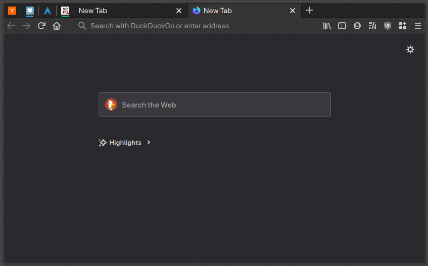
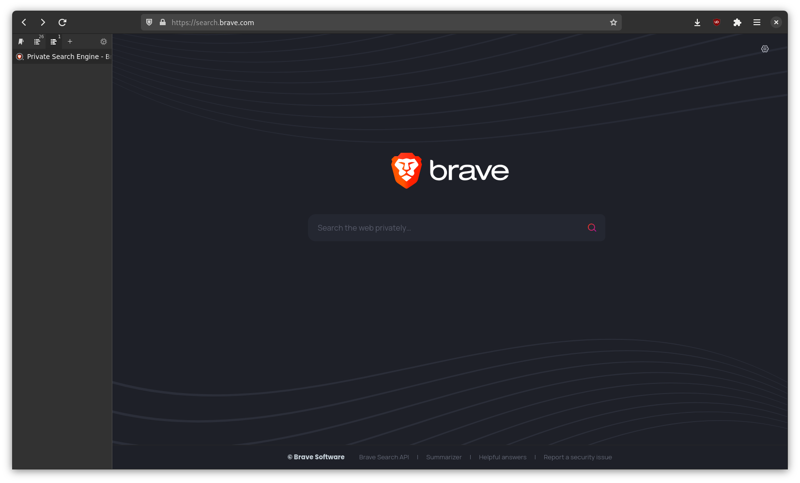

# 🚧 Work In Progress 🚧


# Firefox Styles Snippets (via userChrome.css)

> Note: Starting with Firefox 69 you have to enable toolkit.legacyUserProfileCustomizations.stylesheets in about:config.

In 'Profile Directory' `(Menu > Help > Troubleshooting Information > Profile Directory)`
create folder `chrome` with file `userChrome.css`.

To find and inspect browser's selectors open [Browser Toolbox](https://developer.mozilla.org/en-US/docs/Tools/Browser_Toolbox).

---

### Completely hide tabs strip

```css
#TabsToolbar {
  display: none;
}
```

### Hide tabs strip only in fullscreen

```css
#TabsToolbar[inFullscreen="true"] {
  display: none;
}
```

### Hide sidebar top-menu

```css
#sidebar-header {
  display: none;
}
```

### Dynamic native tabs

  

- Set window preface value:  
`Sidebery settings` > `Help` > `Preface value`  
note: in this example: XXX  
note: value can be an ["empty" unicode sign](https://unicode-explorer.com/c/200B)  
- Set custom css:
```css
#main-window #titlebar {
  overflow: hidden;
  transition: height 0.3s 0.3s !important;
}
/* Default state: Set initial height to enable animation */
#main-window #titlebar { height: 3em !important; }
#main-window[uidensity="touch"] #titlebar { height: 3.35em !important; }
#main-window[uidensity="compact"] #titlebar { height: 2.7em !important; }
/* Hidden state: Hide native tabs strip */
#main-window[titlepreface*="XXX"] #titlebar { height: 0 !important; }
/* Hidden state: Fix z-index of active pinned tabs */
#main-window[titlepreface*="XXX"] #tabbrowser-tabs { z-index: 0 !important; }
```

### Native gnome look (by [@Fletcher-Alderton](https://github.com/Fletcher-Alderton))

  

It's a modified version of the Firefox GNOME theme from https://github.com/rafaelmardojai/firefox-gnome-theme

1. Clone the repo to a subdirectory (in the `chrome`  folder):

```shell
git clone https://github.com/rafaelmardojai/firefox-gnome-theme.git
```
  
2. Create single-line user CSS files if non-existent or empty (at least one line is needed for `sed`):

```shell
[[ -s userChrome.css ]] || echo >> userChrome.css
[[ -s userContent.css ]] || echo >> userContent.css
```
  
3. Import this theme at the beginning of the CSS files (all `@import`s must come before any existing `@namespace` declarations):

```shell
sed -i '1s/^/@import "firefox-gnome-theme\/userChrome.css";\n/' userChrome.css
sed -i '1s/^/@import "firefox-gnome-theme\/userContent.css";\n/' userContent.css
```
  
4. Symlink preferences file:    

```shell
cd .. # Go back to the profile directory
ln -fs chrome/firefox-gnome-theme/configuration/user.js user.js
```

1. Remove Tabs strip (add this to `userChrome.css`)

```css
#TabsToolbar {
  display: none;
}
```

6. Hide sidebar top-menu

```css
#sidebar-header {
  display: none;
}
```

7. Restart Firefox.
