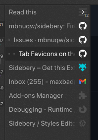
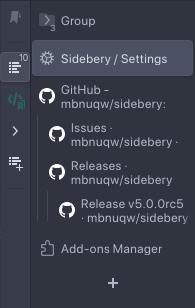

# 🚧 Work In Progress 🚧


# Sidebery's custom css snippets

Styles editor can be found in:  
`Sidebery settings` > `Styles editor` (in the navigation sidebar)  
or `Sidebery settings` > `Appearance` > `Edit styles`  


To get currently available css-selectors use debugger:
  - Enter "about:debugging" in the URL bar
  - In the left-hand menu, click This Firefox (or This Nightly)
  - Click Inspect next to Sidebery extension
  - Select frame to inspect
    - Click on the rectangular icon (with three sections) in top-right area of the debugger page
    - Select "/sidebar/index.html" for sidebar frame
    - Select "/group/group.html" for group page frame
  - Browse "Inspector" tab


### Tab Favicons on the Right



- Set custom css:

```css
.Tab .fav {
  order: 1;
}

.Tab .title {
  padding-left: 8px;
}

.Tab .close {
  right: 24px;
}
```


### Tabs multiline titles



- Set custom css:

```css
#root {
  --tabs-height: 36px !important;
  --tabs-title-padding: 8px;
  --tabs-font-size: 12px;
  --tabs-title-lines: 2;
}

.Tab .t-box {
  align-items: center;
  max-height: calc(var(--tabs-height) - var(--tabs-title-padding));
  overflow: hidden;
}

.Tab .title {
  font-size: var(--tabs-font-size);
  white-space: pre-wrap;
  line-height: calc((var(--tabs-height) - var(--tabs-title-padding)) / var(--tabs-title-lines));
}
```


### Vertical panel labels


- Set layout of navigation bar to "vertical"  
`Sidebery settings` > `Navigation bar` > `Layout`
- Set custom css:

```css
#root {
  --nav-btn-width: 22px;
  --name-font-size: 12px;
  --count-font-size: 10px;
}

.NavigationBar .panel-btn {
  display: flex;
  flex-direction: column-reverse;
  padding: 6px 0;
  height: auto;
}

.NavigationBar .panels-box .panel-btn[data-type="add"] {
  height: var(--nav-btn-width);
}

.NavigationBar .panels-box .panel-btn:not([data-type="add"]) > svg,
.NavigationBar .panels-box .panel-btn > img {
  display: none;
}

.NavigationBar .panel-btn .update-badge {
  top: 1px;
  left: 1px;
}

.NavigationBar .panel-btn .ok-badge,
.NavigationBar .panel-btn .err-badge,
.NavigationBar .panel-btn .progress-spinner {
  display: none;
}

.NavigationBar .panel-btn .len {
  position: relative;
  font-size: var(--count-font-size);
  writing-mode: sideways-lr;
  text-orientation: mixed;
  background-color: transparent;
  padding: 0;
  margin: 0 2px 0 0;
  top: 0;
  right: 0;
  color: var(--container-fg, var(--nav-btn-fg));
}
.NavigationBar .panel-btn .len:before {
  content: ": ";
  font-size: var(--name-font-size);
}

.NavigationBar .panel-btn .name {
  position: relative;
  display: block;
  padding: 0;
  margin: 0 2px 0 0;
  font-size: var(--name-font-size);
  color: var(--container-fg, var(--nav-btn-fg));
  writing-mode: sideways-lr;
  text-orientation: mixed;
}
```
