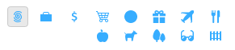

# 🚧 Work In Progress 🚧

# User guide

### Open sidebery
<ul>
Shortcut `ctrl+E` (default) or click on Sidebery button.
</ul>

## Containers
<ul>

\
TODO: What is contianer.\
TODO: How to create and configure it.\
TODO: Usage tips...

</ul>

## Panels
<ul>

TODO: Create screenshot with nav-bar with different panels icons\
TODO: What is panel.\
TODO: How to create and configure it.\
TODO: Usage tips...

### Switching between panels
<ul>
`alt+Comma(<)` - to previous panel  
`alt+Period(>)` - to next panel  
Scroll on navigation strip - (optional)  
Horizontal scroll - (optional)  
</ul>

</ul>
</ul>

## Tabs
<ul>

### Creating new tab
<ul>

**Mouse**\
\- Middle click on free space of tabs panel\
\- Double click on free space of tabs panel (config: Settings/Mouse)

**Keyboard**\
\- Firefox's default `ctrl+T` shortcut - Creates new tab in default container. \
\- `ctrl+space` - In active panel. (config: Settings/Keybindings)\
\- `ctrl+shift+space` - After active tab. (config: Settings/Keybindings)\

> Note: New tabs created outside of Sidebary (e.g. CTRL+T) will be placed at the end of the tabs list (by Firefox defaults) and then optionally moved to the desired place (config: Settings/Position of new tab).

</ul>

### Removing tab[s]
<ul>

**Mouse**\
**Keyboard**
</ul>

### Moving tab[s]
<ul>

**Mouse**\
**Keyboard**

</ul>

### Switching between tabs
<ul>
`ctrl+PgUp/PgDown` - firefox's defaults  
`alt+Up/Down` + `alt+space` - select tab and activate it  
Scroll - (optional)  
</ul>

### Expand/Fold tabs branch
<ul>
Click on favicon of parent tab.  
</ul>

### Select all descendants of tab
<ul>
Right click on the favicon of parent tab.  
</ul>

### Close whole tabs branch
<ul>
Right click on close button of the parent tab.  
</ul>
</ul>

## Bookmarks

## Drag and Drop
<ul>

### Expand/Fold tabs or bookmarks while dragging elements
<ul>
Move mouse cursor to pointer's triangle.  
</ul>

### Switch panel while dragging elements
<ul>
Move mouse cursor to panel's icon.  
</ul>
</ul>
